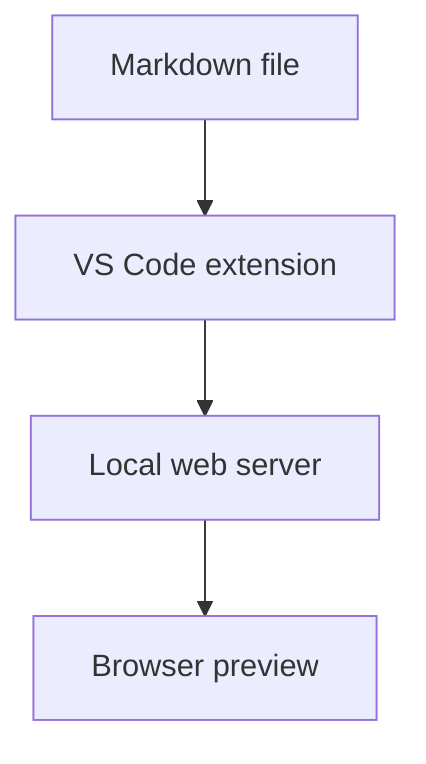

# Mermaid Markdown Server

A VS Code extension that starts a local web server for previewing Markdown files with Mermaid diagrams.

## Features

- Open a browser preview from a Markdown editor or right-click menu.
- Render normal Markdown and fenced `mermaid` code blocks.
- Share the preview on your LAN through `0.0.0.0` binding.
- Stop, reopen, and copy the LAN URL from VS Code commands.
- Keep a standalone CLI entry for quick local testing.

## VS Code Usage

1. Open a `.md` file in VS Code.
2. Run `Mermaid Markdown Server: Open Preview` from the Command Palette.
3. Or right-click inside a Markdown editor and choose `Mermaid Markdown Server: Open Preview`.
4. Open the local URL shown by VS Code.
5. Use `Mermaid Markdown Server: Stop Preview` when finished.

By default, the extension starts:

```text
http://localhost:3000
```

For someone else on the same LAN, use the copied LAN URL, usually:

```text
http://<your-computer-ip>:3000
```

## Settings

```json
{
  "mermaidMarkdownServer.port": 3000,
  "mermaidMarkdownServer.host": "0.0.0.0",
  "mermaidMarkdownServer.autoOpen": true,
  "mermaidMarkdownServer.autoStopAfterMinutes": 30
}
```

Use `0.0.0.0` if other devices on the same network need to open the preview.
Set `autoStopAfterMinutes` to `0` to keep the server running until you stop it manually.

## Mermaid Example

````markdown
# System Flow


````

## Relative Links

The preview root is the directory that contains the Markdown file you opened.
For example, if you start the preview from:

```text
docs/index.md
```

These links are resolved under `docs/`:

```text
Markdown link: Chapter 1 -> ./chapter-1.md
Image path:    Diagram   -> ./images/diagram.png
```

Markdown links open inside the same preview page. Images and other relative files are served through the local preview server.
Paths outside the preview root, such as `../secret.md`, are blocked.

## Development

Install dependencies:

```bash
npm install
```

Run tests:

```bash
npm test
```

Build a VSIX package:

```bash
npm run package
```

Run the standalone server:

```bash
node src/cli.js examples/demo.md --port 3000
```

Debug the VS Code extension:

1. Open this folder in VS Code.
2. Press `F5` to launch an Extension Development Host.
3. Open a Markdown file in the development host.
4. Run `Mermaid Markdown Server: Open Preview`.

## Release Automation

The CI workflow runs tests and uploads a packaged VSIX artifact for pushes and pull requests.
The release workflow runs when you push a tag like `v0.1.0` or start it manually from GitHub Actions.
It creates a GitHub Release with the VSIX attached.

To also publish to the VS Code Marketplace, add a repository secret named `VSCE_PAT`.

## Current Limitation

The browser preview loads `marked` and `mermaid` from jsDelivr. The preview browser needs internet access for those libraries. A later version can vendor those scripts for fully offline use.
