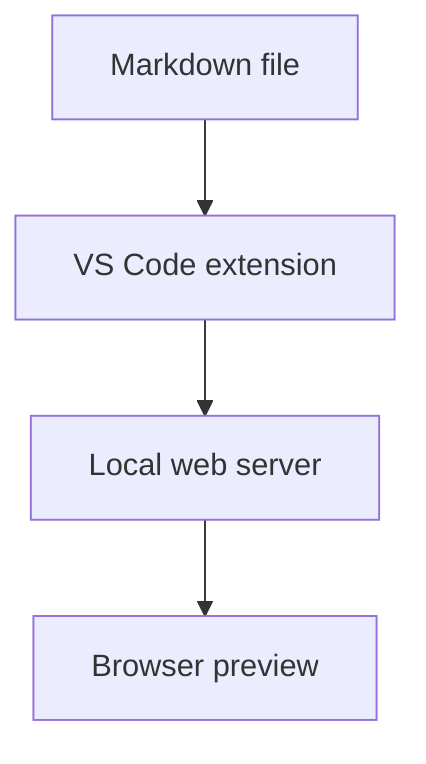

# Mermaid Markdown Server

A VS Code extension that starts a local web server for previewing Markdown files with Mermaid diagrams.

## Features

- Open a browser preview from a Markdown editor or right-click menu.
- Render normal Markdown and fenced `mermaid` code blocks.
- Stop and reopen the preview from VS Code commands.

## VS Code Usage

1. Open a `.md` file in VS Code.
2. Run `Mermaid Markdown Server: Open Preview` from the Command Palette.
3. Or right-click inside a Markdown editor and choose `Mermaid Markdown Server: Open Preview`.
4. Open the local URL shown by VS Code.
5. Use `Mermaid Markdown Server: Stop Preview` when finished.

By default, the extension starts:

```text
http://localhost:3000
```

## Settings

```json
{
  "mermaidMarkdownServer.port": 3000,
  "mermaidMarkdownServer.autoOpen": true,
  "mermaidMarkdownServer.autoStopAfterMinutes": 30
}
```

Set `autoStopAfterMinutes` to `0` to keep the server running until you stop it manually.

## Mermaid Example

````markdown
# System Flow


````

## Relative Links

The preview root is the directory that contains the Markdown file you opened.
For example, if you start the preview from:

```text
docs/index.md
```

These links are resolved under `docs/`:

```text
Markdown link: Chapter 1 -> ./chapter-1.md
Image path:    Diagram   -> ./images/diagram.png
```

Markdown links open inside the same preview page. Images and other relative files are served through the local preview server.
Paths outside the preview root, such as `../secret.md`, are blocked.
