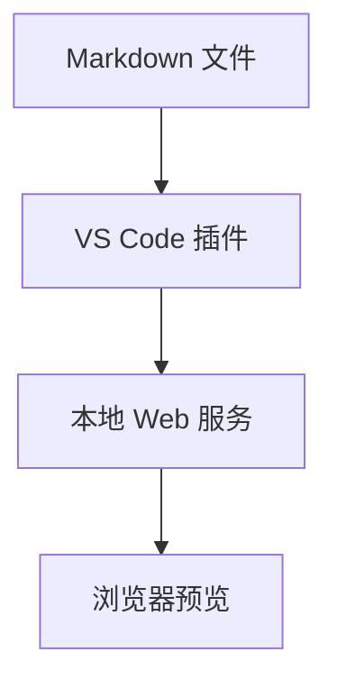

# Mermaid Markdown Server

中文 | [English](./README.en.md)

一个 VS Code 插件，用本地 Web 服务预览 Markdown 文件，并渲染其中的 Mermaid 图表。

## 功能

- 从 Markdown 编辑器或右键菜单一键打开浏览器预览。
- 渲染普通 Markdown 和 fenced `mermaid` 代码块。
- 根据当前 Markdown 引用到的其他 Markdown 生成左侧文档导航。
- 支持停止服务和重新打开预览。

## 使用方式

1. 在 VS Code 中打开一个 `.md` 文件。
2. 从命令面板运行 `Mermaid Markdown Server: Open Preview`。
3. 或者在 Markdown 编辑器里右键，选择 `Mermaid Markdown Server: Open Preview`。
4. 插件会打开浏览器预览页面。
5. 用完后运行 `Mermaid Markdown Server: Stop Preview` 停止服务。

默认情况下，插件会先使用：

```text
http://localhost:3000
```

如果这个端口已经被占用，插件会自动尝试下一个可用端口。

## 配置

```json
{
  "mermaidMarkdownServer.port": 3000,
  "mermaidMarkdownServer.autoOpen": true,
  "mermaidMarkdownServer.autoStopAfterMinutes": 30
}
```

如果不想自动停止服务，把 `autoStopAfterMinutes` 设置为 `0`。

## Mermaid 示例

````markdown
# 系统流程


````

## 相对路径

预览根目录是你打开的 Markdown 文件所在目录。
例如从下面这个文件启动预览：

```text
docs/index.md
```

下面这些相对路径都会在 `docs/` 目录下解析：

```text
Markdown link: Chapter 1 -> ./chapter-1.md
Image path:    Diagram   -> ./images/diagram.png
```

Markdown 链接会在同一个预览页面内打开。图片和其他相对资源会通过本地预览服务读取。
为了避免读取到不该访问的文件，类似 `../secret.md` 这种逃出预览根目录的路径会被阻止。

## 文档导航

预览页面左侧会显示从当前入口 Markdown 出发的引用树。插件只会收集 Markdown 链接，例如：

```markdown
[第一章](chapter-1.md)
[附录](appendix/a.md)
```

图片链接不会出现在导航中。循环引用会被自动跳过，避免导航无限展开。
