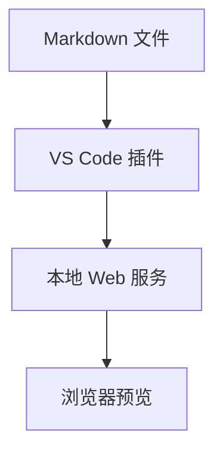

# Mermaid Markdown Server

中文 | [English](./README.en.md)

一个 VS Code 插件，用本地 Web 服务预览 Markdown 文件，并渲染其中的 Mermaid 图表。

## 功能

- 从 Markdown 编辑器或右键菜单一键打开浏览器预览。
- 渲染普通 Markdown 和 fenced `mermaid` 代码块。
- 通过 `0.0.0.0` 绑定把预览地址分享给同一局域网的人。
- 支持停止服务、重新打开预览、复制局域网访问地址。
- 保留独立 CLI，方便本地调试。

## 使用方式

1. 在 VS Code 中打开一个 `.md` 文件。
2. 从命令面板运行 `Mermaid Markdown Server: Open Preview`。
3. 或者在 Markdown 编辑器里右键，选择 `Mermaid Markdown Server: Open Preview`。
4. 插件会打开浏览器预览页面。
5. 用完后运行 `Mermaid Markdown Server: Stop Preview` 停止服务。

默认地址是：

```text
http://localhost:3000
```

如果要给同一局域网的人访问，运行 `Mermaid Markdown Server: Copy LAN URL`，通常会得到类似：

```text
http://<你的电脑IP>:3000
```

## 配置

```json
{
  "mermaidMarkdownServer.port": 3000,
  "mermaidMarkdownServer.host": "0.0.0.0",
  "mermaidMarkdownServer.autoOpen": true,
  "mermaidMarkdownServer.autoStopAfterMinutes": 30
}
```

如果需要局域网访问，保持 `host` 为 `0.0.0.0`。
如果不想自动停止服务，把 `autoStopAfterMinutes` 设置为 `0`。

## Mermaid 示例

````markdown
# 系统流程


````

## 相对路径

预览根目录是你打开的 Markdown 文件所在目录。
例如从下面这个文件启动预览：

```text
docs/index.md
```

下面这些相对路径都会在 `docs/` 目录下解析：

```text
Markdown link: Chapter 1 -> ./chapter-1.md
Image path:    Diagram   -> ./images/diagram.png
```

Markdown 链接会在同一个预览页面内打开。图片和其他相对资源会通过本地预览服务读取。
为了避免读取到不该访问的文件，类似 `../secret.md` 这种逃出预览根目录的路径会被阻止。

## 开发

安装依赖：

```bash
npm install
```

运行测试：

```bash
npm test
```

打包 VSIX：

```bash
npm run package
```

运行独立服务：

```bash
node src/cli.js examples/demo.md --port 3000
```

调试 VS Code 插件：

1. 用 VS Code 打开本仓库。
2. 按 `F5` 启动 Extension Development Host。
3. 在新窗口中打开一个 Markdown 文件。
4. 运行 `Mermaid Markdown Server: Open Preview`。

## 发布自动化

CI workflow 会在 push 和 pull request 时运行测试，并上传打包后的 VSIX artifact。
Release workflow 会在推送类似 `v1.0.0` 的 tag，或从 GitHub Actions 手动触发时运行。
它会创建 GitHub Release，并把 VSIX 附加到 release。

如果还要发布到 VS Code Marketplace，在 GitHub 仓库里添加名为 `VSCE_PAT` 的 secret。

## 当前限制

浏览器预览会从 jsDelivr 加载 `marked` 和 `mermaid`。因此预览浏览器需要能访问网络。
后续版本可以把这些脚本内置到插件里，支持完全离线使用。
