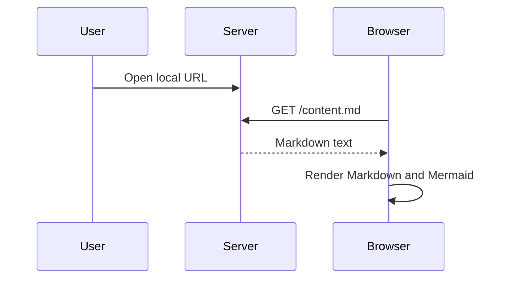

# Example Document

This is a Markdown file with a Mermaid diagram.

```mermaid
sequenceDiagram
  participant User
  participant Server
  participant Browser
  User->>Server: Open local URL
  Browser->>Server: GET /content.md
  Server-->>Browser: Markdown text
  Browser->>Browser: Render Markdown and Mermaid
```
